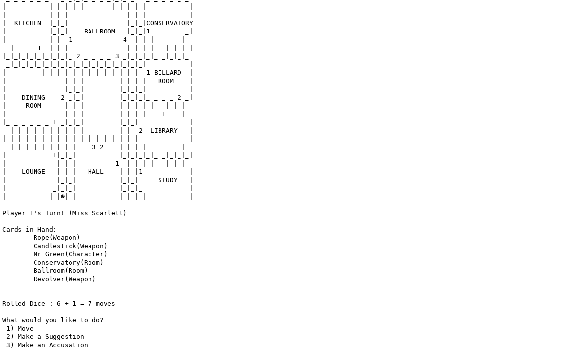
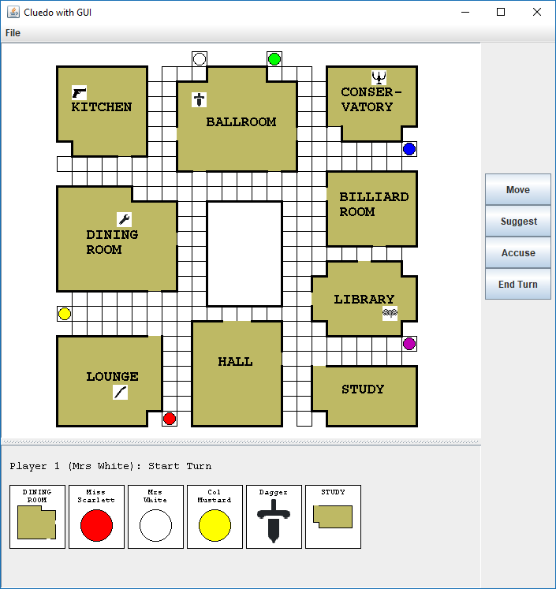

# SWEN 225 - Software Design

### Course learning objectives
Students who pass this course should be able to:

1. Competently analyse a software engineering problem and design and implement a solution, using appropriate tools.
2. Apply correctly a range of techniques and notations for designing extensible and reusable software.
3. Apply correctly techniques for ensuring and assessing the quality of software.
4. Work co-operatively in a team to solve a software engineering problem.

### Note
This document covers projects and assignments made while studying SWEN225 - Software Design.

The source files are unable to be published to the public to help ensure academic integrity and due to copyright concerns involved with the assignment scaffolding.

# Assignments

## Assignment 1 - Cluedo Clone - A Text Only Murder Mystery
### Description

A joint project using UML to create a CLUEDO clone.

Successfully created a text only implementation of a simplified Cluedo game, taking only keyboard inputs and outputting only to the console.

## Assignment 2 - Cluedo Clone - A GOOEY Murder Mystery
### Description

A joint project building off the previous assignment to add a GUI. 

### Features
+ Shows full game information while playing
+ Contains menu bar for easy creation of a New Game or quitting
+ Displays Cards with the same images as on the board
+ Includes buttons and key listeners for navigation on the board
